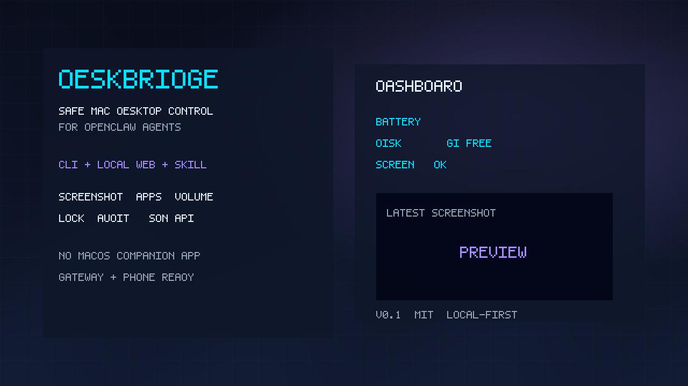

# DeskBridge

Safe **Mac desktop control** for [OpenClaw](https://github.com/openclaw/openclaw) agents and humans — local web console + CLI + skill.

No OpenClaw macOS companion app. No full remote-desktop stack. Gateway-host Mac only.



## Why DeskBridge?

You already chat with an agent from your phone (ClawRemote / OpenClaw clients). You want:

- “Screenshot my Mac”
- “Open Notion”
- “Mute / set volume”
- “Lock the machine”

…with **structured JSON**, **risk tiers**, an **audit log**, and a small **local control plane** — not another menubar AI toy and not TeamViewer.

## Features

- **CLI** `deskbridge` with agent-friendly JSON
- **Local web console** (Dashboard, History, Settings) on `127.0.0.1:8788`
- **Actions:** screenshot, open app/URL, list/focus/quit apps, volume/mute, notify, clipboard, lock, sleep display, status
- **Risk policy:** low / medium / high with confirm gates
- **SQLite audit history**
- **OpenClaw skill** under `skill/desktop-control`
- macOS built-ins only (`screencapture`, `open`, `osascript`, `pmset`, …)

## Install

```bash
cd deskbridge
python3 -m venv .venv
source .venv/bin/activate
pip install -e ".[dev]"
```

Requires **macOS** + Python 3.11+.

### Permissions

- **Screen Recording** → process running DeskBridge / OpenClaw Gateway (for screenshots)
- **Automation** → System Events (for list-apps / some quit paths)
- **Accessibility** → optional, improves lock via keystroke fallback

## Quick start

```bash
# status JSON
deskbridge status

# screenshot (path in JSON → attach in chat)
deskbridge screenshot

# open app / URL
deskbridge open-app chrome
deskbridge open-url https://example.com

# volume
deskbridge volume --get
deskbridge volume --level 30
deskbridge mute

# high-risk (explicit)
deskbridge lock --yes

# local web console
deskbridge serve
# open http://127.0.0.1:8788
```

### OpenClaw skill

Copy or symlink `skill/desktop-control` into your OpenClaw workspace skills, or point agents at the installed `deskbridge` CLI.

## Use Cases

### 1) Away-from-desk check-in
**Who:** indie hacker on a walk  
**Before:** SSH in and guess, or start a full remote desktop session  
**After:** From ClawRemote: “screenshot my mac” → DeskBridge captures PNG → agent sends media back

```bash
deskbridge screenshot
```

### 2) Meeting mode in one message
**Who:** remote worker joining a call  
**Before:** fumble dock icons on the laptop across the room  
**After:** “open zoom, mute mac, notify me ready”

```bash
deskbridge open-app zoom
deskbridge mute
deskbridge notify --title "DeskBridge" --body "Muted and Zoom opening"
```

### 3) Agent ops with an audit trail
**Who:** OpenClaw power user automating chores  
**Before:** ad-hoc shell with no history of what the agent did to the desktop  
**After:** every action lands in SQLite history; review in web **History** page

```bash
deskbridge history --limit 20
deskbridge serve   # History tab
```

## Why not X?

| Alternative | Why DeskBridge instead |
|-------------|------------------------|
| **Clicky** | Local AI tutor/pointer app with its own stack — not Gateway-remote agent control |
| **TeamViewer / RustDesk** | Full remote desktop; heavy when you only need structured actions |
| **ClawHub mac-use / computer-use skills** | Often GUI-click runtimes or thin docs; weak product UX + mixed trust |
| **OpenClaw macOS app node** | Powerful, but DeskBridge targets **Gateway-only** users |

## Architecture

```
CLI / Web / OpenClaw skill
        ↓
 DesktopService (risk + audit)
        ↓
 DarwinAdapter (macOS built-ins)
        ↓
 SQLite audit + screenshot media
```

## Development

```bash
pip install -e ".[dev]"
pytest
python scripts/generate_project_image.py
```

## Security notes

- Default bind **127.0.0.1** only
- High-risk actions need `--yes` / `confirm: true`
- Clipboard contents are redacted in audit params
- Do not expose the server to the public internet without auth (planned in ROADMAP)

## License

MIT — see [LICENSE](LICENSE).

## Roadmap

See [ROADMAP.md](ROADMAP.md).
